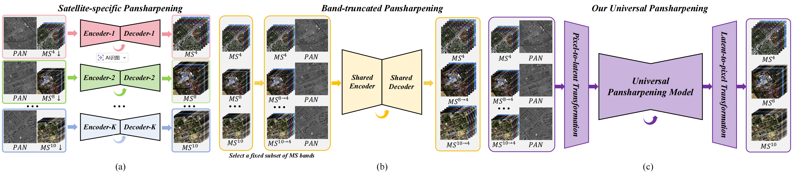
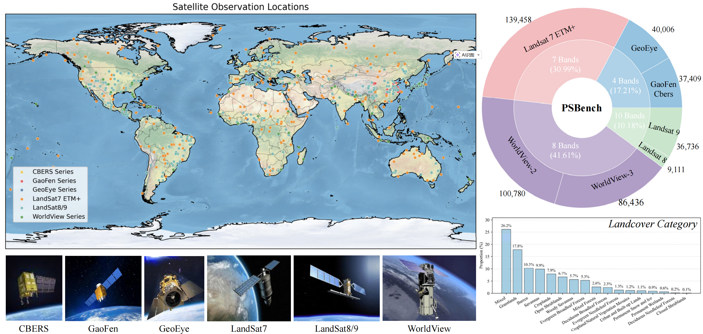
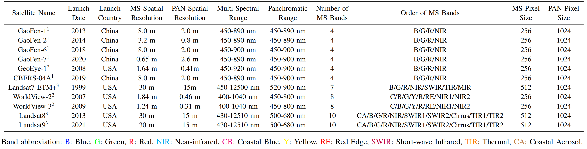
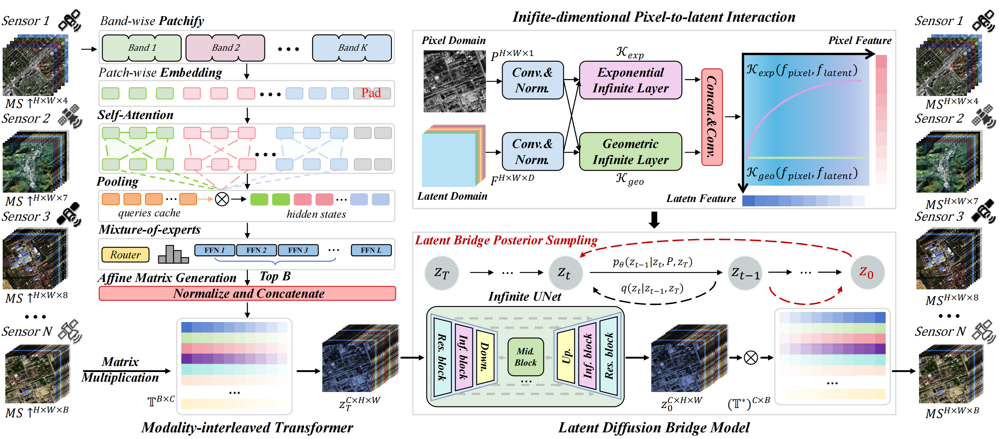

# Project (FoundPS)

# Universal Pansharpening Foundation Model

<em>Hebaixu Wang, Jing Zhang, Haonan Guo, Di Wang, Jiayi Ma, Bo Du and Liangpei Zhang</em>.

[Paper](https://arxiv.org/) |  [Github Code](https://github.com/MiliLab/FoundPS)

## Abstract

Pansharpening generates the high-resolution multi-spectral (MS) image by integrating spatial details from a texture-rich panchromatic (PAN) image and spectral attributes from a low-resolution MS image. Existing methods are predominantly satellite-specific and scene-dependent, which severely limits their generalization across heterogeneous sensors and varied scenes, thereby reducing their real-world practicality. To address these challenges, we present FoundPS, a universal pansharpening foundation model for satellite-agnostic and scene-robust fusion. Specifically, we introduce a modality-interleaved transformer that learns band-wise modal specializations to form reversible spectral affine bases, mapping arbitrary-band MS into a unified latent space via tensor multiplication. Building upon this, we construct a latent diffusion bridge model to progressively evolve latent representations, and incorporate bridge posterior sampling to couple latent diffusion with pixel-space observations, enabling stable and controllable fusion. Furthermore, we devise infinite-dimensional pixel-to-latent interaction mechanisms to comprehensively capture the cross-domain dependencies between PAN observations and MS representations, thereby facilitating complementary information fusion. In addition, to support large-scale training and evaluation, we construct a comprehensive pansharpening benchmark, termed PSBench, consisting of worldwide MS and PAN image pairs from multiple satellites across diverse scenes. Extensive experiments demonstrate that FoundPS consistently outperforms state-of-the-art methods, exhibiting superior generalization and robustness across a wide range of pansharpening tasks.

## Introducation

## Dataset

## Overview

## Model Checkpoint

TODO

### Contributor

Baixuzx7 @ wanghebaixu@gmail.com

### Copyright statement

The project is signed under the MIT license, see the [LICENSE.md](https://github.com/MiliLab/FoundPS/LICENSE.md)
